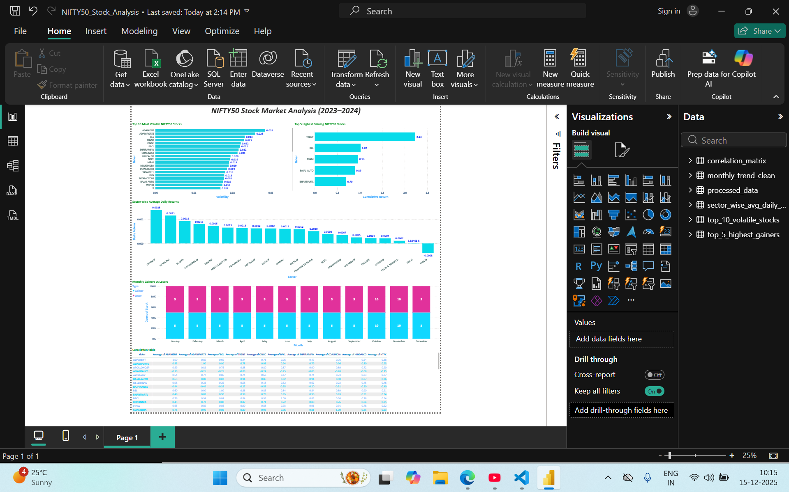
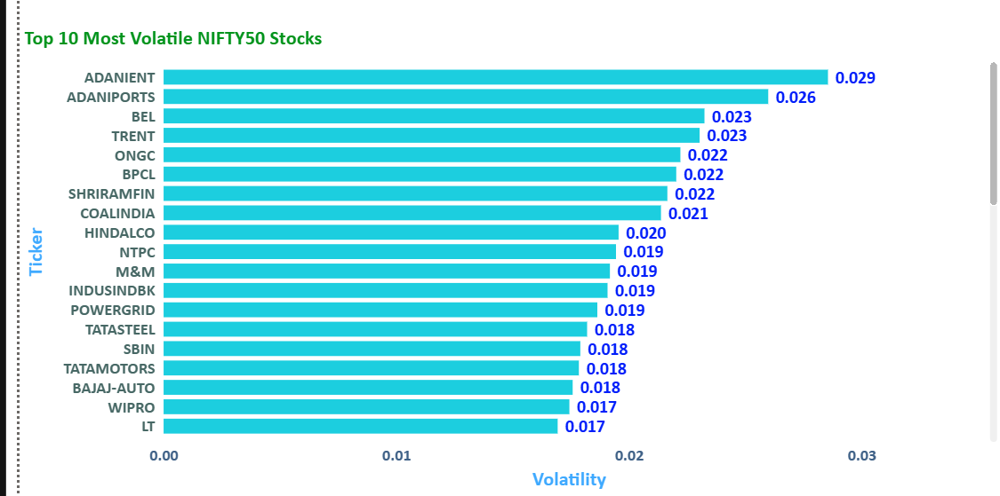
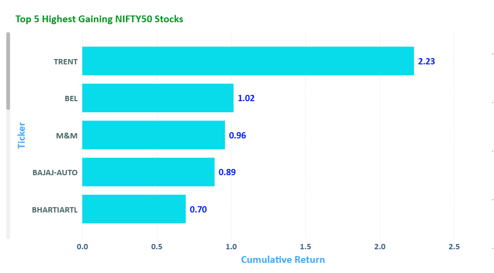
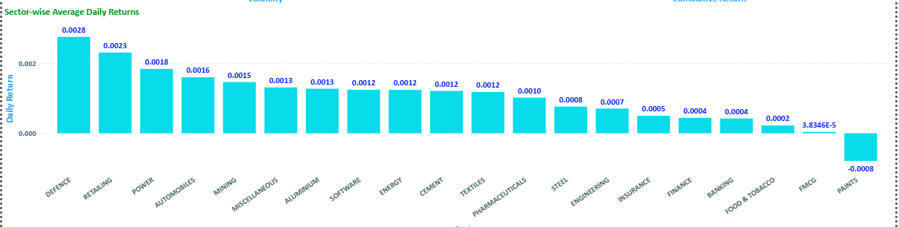
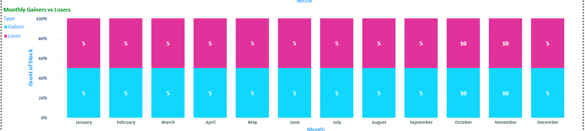
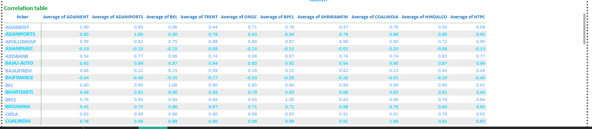

# 📊 Data-Driven Stock Analysis (NIFTY50)

## 📌 Project Overview
This project presents a comprehensive, data-driven analysis of **NIFTY50 stocks** for the period **2023–2024**.  
The goal is to analyze stock performance, volatility, sector trends, correlations, and monthly gainers/losers using **Python, SQL, Power BI, and Streamlit**.

The project converts raw market data into meaningful insights through structured data processing and interactive dashboards.

---

## 🎯 Problem Statement
Investors and analysts often struggle to interpret large volumes of stock market data efficiently.  
This project aims to:
- Analyze daily stock performance
- Identify top-performing and worst-performing stocks
- Understand volatility and risk
- Compare sector-wise performance
- Study correlations between stock prices
- Track monthly gainers and losers

---

## 🧰 Tools & Technologies Used
- **Programming Language:** Python  
- **Libraries:** Pandas, NumPy, Matplotlib, SQLAlchemy  
- **Database:** MySQL / PostgreSQL  
- **Visualization Tools:** Power BI, Streamlit  
- **Version Control:** Git & GitHub  

---

## 🗂️ Data Processing Workflow
1. Extracted raw stock market data
2. Cleaned missing and inconsistent values
3. Calculated key metrics such as:
   - Daily returns
   - Cumulative returns
   - Volatility (standard deviation)
   - Monthly returns
4. Stored processed data in a SQL database
5. Built interactive dashboards using Power BI

---

## 📈 Key Visualizations & Insights

### 1️⃣ Top 10 Most Volatile NIFTY50 Stocks
- Stocks like **ADANIENT, ADANIPORTS, BEL, and TRENT** showed the highest volatility.
- High volatility indicates higher risk and larger price fluctuations.
- These stocks may suit short-term traders rather than conservative investors.

---

### 2️⃣ Top 5 Highest Gaining Stocks (Cumulative Return)
- **TRENT** emerged as the top-performing stock with the highest cumulative return.
- Other strong performers include **BEL, M&M, BAJAJ AUTO, and BHARTIARTL**.
- These stocks showed consistent growth over the year.

---

### 3️⃣ Sector-wise Average Daily Returns
- **Defense, Retail, and Power sectors** recorded higher average daily returns.
- **Paints and FMCG sectors** showed relatively lower or negative average returns.
- Sector analysis helps investors diversify and manage risk effectively.

---

### 4️⃣ Monthly Gainers vs Losers Analysis
- Each month shows an almost balanced number of gainers and losers.
- **October and November** experienced higher stock movements.
- Monthly trends help identify seasonal or momentum-based opportunities.

---

### 5️⃣ Stock Price Correlation Matrix
- Many stocks within the same sector show **high positive correlation**.
- Banking and IT stocks tend to move together.
- Correlation analysis helps in **portfolio diversification** to reduce risk.

---

## 📊 Dashboard Summary
The Power BI dashboard provides:
- Clear comparison of volatile vs stable stocks
- Easy identification of top gainers and losers
- Sector performance overview
- Interactive filters for deeper analysis

---

## 📌 Business Use Cases
- **Investment Decision Support:** Identify stable vs risky stocks
- **Portfolio Diversification:** Reduce risk using correlation insights
- **Market Trend Analysis:** Understand sector momentum
- **Performance Tracking:** Monitor monthly and yearly stock behavior

---
## 🗃️ Project Structure

├── code/                 # Python scripts for data processing & analysis
├── data/                 # Cleaned & processed datasets
├── screenshots/          # Power BI dashboard images
├── NIFTY50_Stock_Analysis.pbix
├── README.md
├── requirements.txt

## 📁 Project Deliverables
- Cleaned and processed stock market dataset
- SQL database with structured tables
- Power BI interactive dashboard
- Python scripts for data processing
- Streamlit application (optional extension)

---

## 🔗 Dataset
The dataset used for this project is provided as part of the GUVI project resources.

---

## ▶️ How to Run the Project

### 1️⃣ Clone the Repository
```bash
git clone https://github.com/NihaaraaDilras21/Data-Driven-Stock-Analysis.git
cd Data-Driven-Stock-Analysis
```

---

### 2️⃣ Create a Virtual Environment (Optional but Recommended)
```bash
python -m venv venv
```

Activate it:

**Windows**
```bash
venv\Scripts\activate
```

**Mac / Linux**
```bash
source venv/bin/activate
```

---

### 3️⃣ Install Required Dependencies
```bash
pip install -r requirements.txt
```

---

### 4️⃣ Run Data Processing Scripts
Navigate to the `code` folder:
```bash
cd code
```

Run the scripts in the following order:
```bash
python read_one_yaml.py
python combine_yaml_to_csv.py
python clean_data.py
python add_returns.py
python split_stocks.py
```

---

### 5️⃣ Run Analysis Scripts
```bash
python analysis_1_volatility.py
python analysis_2_top_gainers.py
python analysis_3_sector_avg.py
python analysis_4_monthly_gainers_losers.py
python analysis_5_correlation_matrix.py
python analysis_6_prepare_monthly_trend.py
```

These scripts generate cleaned and aggregated CSV files inside the **`data/`** folder.

---

### 6️⃣ Load Data into Power BI
1. Open **`NIFTY50_Stock_Analysis.pbix`** using Power BI Desktop  
2. Refresh data if required  
3. Explore interactive dashboards and insights

---

### 🔎 Optional: Database Integration
If PostgreSQL is configured locally:
```bash
python load_to_postgres.py
```

---

### 📝 Notes
- All processed datasets are saved in the **`data/`** folder  
- Dashboard screenshots are available in the **`screenshots/`** folder  
- Power BI is used for final visualization and insights


## 📊 Power BI Dashboard Preview

### 🔹 Overall Dashboard


### 🔹 Top 10 Most Volatile Stocks


### 🔹 Top 5 Highest Gaining Stocks


### 🔹 Sector-wise Average Daily Returns


### 🔹 Monthly Gainers vs Losers


### 🔹 Stock Correlation Table


---

## 📈 Key Insights

- A small set of stocks contributed disproportionately to overall market volatility, indicating higher risk exposure in specific companies.
- The top gaining stocks showed strong cumulative returns, outperforming the broader NIFTY50 index during the analysis period.
- Sector-wise analysis revealed that certain sectors consistently delivered higher average daily returns, highlighting sector rotation trends.
- Monthly gainers vs losers analysis showed increased market volatility during specific months, reflecting short-term market sentiment shifts.
- Correlation analysis indicated strong positive correlations among stocks within the same sector, while inter-sector correlations remained relatively moderate.

---

## ✅ Results & Conclusion

- Successfully transformed raw stock market data into meaningful insights using Python, SQL, and Power BI.
- Built an interactive Power BI dashboard enabling easy exploration of volatility, returns, sector performance, and correlations.
- The project demonstrates how data analytics can support informed investment decisions and market trend analysis.
- This dashboard can be extended further with real-time data integration and predictive analytics.

## 🏷️ Technical Tags
`Python` `SQL` `Power BI` `Data Analysis` `Stock Market` `NIFTY50` `Visualization`
